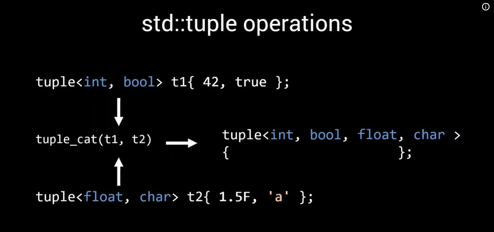
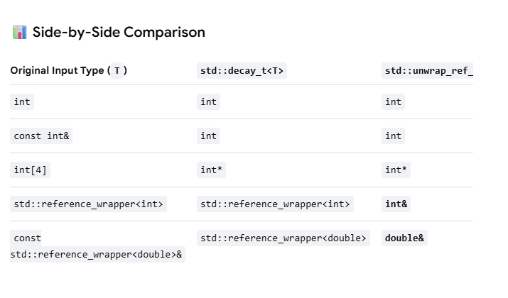

In this lesson lets consider std::tuple 

We also need to figure out how to map the values to the corresponding types in tuple. For that we need to figure out steps at compile time and ensure __no unnecessary copies/moves__ at runtime
+ lvalue + rvalue
+ perfect forwarding

__WHAT IS TUPLE__
+ Recursive inheritance
    - The tuple is only responsible for the first element
    
    Example
        
        Tuple<int, bool, char > { char data; }
            🠋 (inherit from)
        Tuple<bool, char> { char data; }
            🠋 (inherits from)
        Tuple<char> { char data; }

+ Multiple Inheritance
    - The tuple inherits from each of the types. This boils down to a static_cast
    
    Example

        Tuple<int, bool, float> tuple;
        To get float static_cast<float>(tuple) = true;
    
    But this approach has a problem. If there are two items in the tuple of the same type. Say tuple<int, bool, bool> t

    The common approach is
    template<size_t index, typename T>
    struct TupleData {
        T data;
    }

        TupleData<0, int> TupleData< 1, bool> TupleData<2, bool>
                🠋           🠋                   🠋
        Tuple< int,         bool,               bool>

        In this case we can get the second element by casting the tuple to the correct base class

        
        Here we aim for simplicity and speed....
        recursive allows for simpler algorithms -> so this is what we will start with.....
    	But we will revisit the multiple inheritance as well...

Before proceeding with tuple we are looking at how the make_tuple function works. The possible implementation section in cpp 
section gives how make_tuple could create a tuple by using __std::unwrap_ref_decay_t__

The deduction guide simply explains the relation between the arguments used
for construction of tuple and the actual constructor that needs to be called to build the object...

Know the difference between auto type and decltype(auto). The latter case can deduce reference types as well....

Also std::remove_cvref_t -> This is used for removing the const and volatile qualifiers for the tuple type....

Use std::remove_cvref_t when:

    You are writing generic template containers and need to know the exact type to instantiate  (e.g., if someone passes a const int[5]&, 
    you want to allocate a int[5], not an int*).You want a cleaner, faster-compiling alternative to std::decay_t when you know your type is a basic scalar, class, or struct.
    
Use std::decay_t when:
    
    You want to store a type exactly the way __auto would deduce it__ 
    You need to store arguments passed via forward references (Args&&...) inside a container or tuple 
    (like std::make_tuple does internally) and want arrays/functions to safely become pointers so they do not dangle.

While testing the rvalue, we are regular reference to rvalue reference(&&) After this before we check if the type is a const, we should remove the reference type
using std::remove_reference_t <>; Without this std::is_const won't work propertly for rvalue....

Also there is way to check if the type is a lvalue reference or not
std::is_lvalue_reference<>;

An alternate to decltype 

    std::declval<T>() -> can be used when Type T does not have a default constructor

    struct nodefault
    {
        nodefault(int x ); // ---> Note this structure does not have a default constructor....
        double ret_val() { return 5.0; }
    };

    template<typename T>
    struct TypeTT
    {
        using type = decltype(std::declval<T>()::ret_val()); // ---> This is used to call T() which does not have a default constructor ... 
    };

    int main()
    {
        TypeTT<nodefault>::type x = 52.0
    }

Important points to remember:

    std::declval<T>() ------> Instantiates a T&& (rvalue)
    std::declval<T&>()  ----> Instantiates a T&  (lvalue)
    std::declval<const T>()-> Mimics a const rvalue of T (const T&&)

We use the copystats object to record the number of copies happening....
INitially the make_tuple function generates 
{default constructs : 0, copies:4, moves:0}

So we do a forward instead of copy
Which provides
{default constructs : 0, copies:3, moves:0} -> 1 lesser.... From here we go to the tuple class itself...

NOTE: For a && to mean a forwarding reference, type deduction should be involved....
